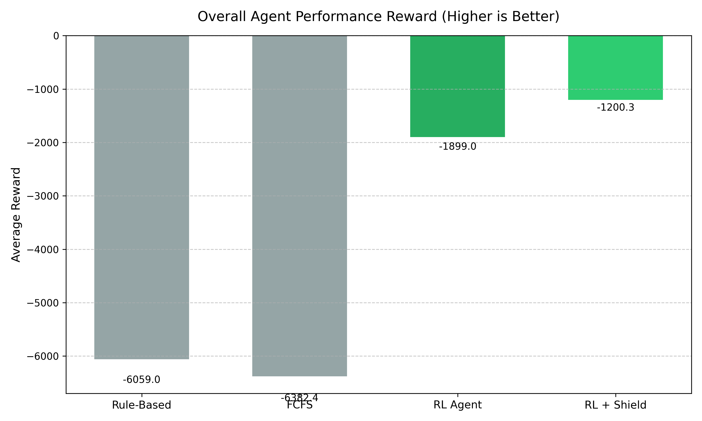
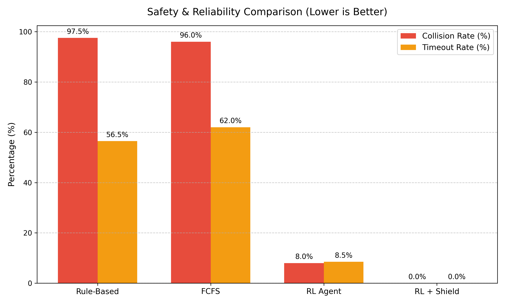
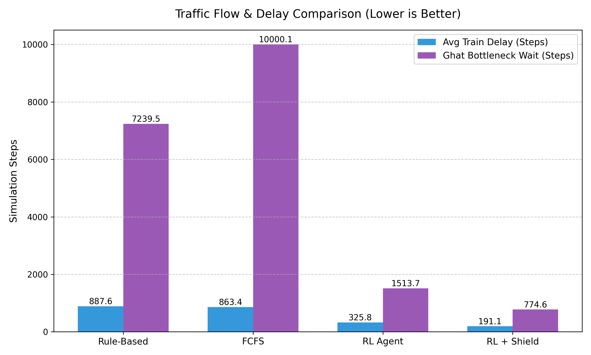

# ORBIT 🚆🧠
### AI-powered train precedence & dispatch for the CSMT–Manmad corridor

ORBIT is a reinforcement learning system for train precedence and dispatch on complex railway networks — built and tested on a simulation of the real CSMT–Manmad corridor. A PPO agent (trained in a custom Gymnasium environment) learns to hold, proceed, or divert trains to resolve conflicts under high traffic density, while a deterministic OR-Tools safety shield sits in front of it to guarantee the network never deadlocks or lets two trains collide.

## 📊 Benchmarks (25-train stress test)

We ran Rule-Based dispatch, FCFS, the raw RL agent, and RL+Shield against the same high-density 25-train schedule, 15 episodes each (`backend/results/benchmark_table.json`).

### Reward
RL+Shield comes out ahead on average reward and, just as importantly, has the tightest spread — the rule-based and FCFS baselines have much wilder episode-to-episode variance (including some badly negative episodes for FCFS).



### On-time performance & safety
None of the four methods produced a collision or a timeout in this run — the environment itself prevents illegal moves regardless of dispatcher, so "safety" here comes down to *how efficiently* a method avoids blocking itself into corners. RL+Shield gets trains in on time noticeably more often than the baselines (87.5% vs. 68% / 67.2%).



### Delay & the ghat bottleneck
The biggest gap shows up at the Kasara–Igatpuri ghat section, the single-line token-block chokepoint on the corridor. RL-based methods learn to proactively divert trains into loop lines ahead of the ghat to let higher-priority traffic through, cutting average wait time there substantially versus the static baselines.



**Summary (RL Agent vs. Rule-Based, from `benchmark_table.txt`):** +30.8% average reward, +14.4pp on-time rate, meaningfully lower variance and better worst-case episodes. *(Note: this particular comparison isn't statistically significant at 15 episodes — p ≈ 0.18 — treat it as a solid early signal rather than a proven result. Re-run with more episodes for a stronger claim.)*

## ✨ Core Features

- **RL dispatcher** — `MaskablePPO` (Stable-Baselines3 / `sb3-contrib`) trained in a custom Gymnasium environment (`backend/train_env.py`) that decides HOLD / PROCEED / DIVERT for every train each tick.
- **Curriculum training** — the agent wasn't thrown at 25 trains from the start. It's trained level by level (2 → 5 → 7 → 10 → 15 → 25 concurrent trains), with checkpoints for each stage saved under `backend/ai/models/Phase3/`.
- **Deterministic safety shield** — `backend/or_tools/smart_optimizer.py` intercepts the RL agent's raw action before it's applied and corrects anything that would cause a collision or capacity violation. This is what actually guarantees safety, not the RL policy itself.
- **OR-Tools schedule generation** — `backend/or_tools/corridor_planner.py` builds a conflict-free base timetable via constraint programming, which the RL agent then dispatches trains against.
- **Ghat / token-block signalling** — the Kasara–Igatpuri ghat section is modeled as the real single-line, token-controlled bottleneck it is, with directional token ownership and queueing on both ends.
- **Live digital-twin backend** — async FastAPI server (`backend/main.py`) running the simulation as a background task, streaming state to the frontend over WebSockets, with SQLite persistence for the fleet.
- **Dashboard** — React + TypeScript + Vite frontend: live schematic map, fleet status, the AI Co-Pilot's decision feed (with override/modify controls for a human dispatcher), maintenance block management, and an audit log.

## 🏗️ Architecture

```
AI_Train_Precedence/
├── backend/
│   ├── main.py          # FastAPI app + startup wiring
│   ├── train_env.py     # the simulation itself — track physics, signalling, RL env
│   ├── state.py         # single shared in-memory sim state used across the backend
│   ├── topology.py      # loads/serves the track graph
│   ├── config.py        # corridor paths, timing constants, fleet defaults
│   ├── database.py      # SQLite persistence for the fleet
│   ├── routers/         # FastAPI route modules
│   ├── services/        # logic behind the routers, incl. the background sim loop
│   ├── ai/               # training pipeline, curriculum runner, model checkpoints
│   ├── or_tools/          # safety shield + CP-based schedule optimizer
│   ├── scripts/            # baselines, benchmarking, eval scripts
│   ├── results/              # benchmark output (JSON/TXT + generated charts)
│   └── tests/                 # pytest suite
├── frontend/
│   └── src/
│       ├── pages/         # Dashboard, Fleet Status, Control Centre, Landing
│       ├── components/    # KineticMap, AI Co-Pilot panel, Marey timeline, etc.
│       ├── store/          # Zustand stores (sim state, presentation/animation, copilot...)
│       ├── hooks/           # useCopilot etc.
│       └── utils/            # topology → schematic layout conversion
└── topology.json         # the serialized track graph (nodes, edges, stations)
```

A couple of files worth knowing if you're digging into the code: `train_env.py` is where most of the complexity actually lives — block occupancy, platform/loop reservation, dwell times, braking, and the ghat token-block logic all happen there. `state.py` is a single shared object (fleet registry, live train positions, the loaded model/env, safety-shield toggle, audit log) that most of the rest of the backend reads from and writes to. On the frontend, `KineticMap` turns `edge_id` + `position_percentage` from the backend into an animated train position on the schematic map, and `usePresentationStore` is kept deliberately separate from the raw sim state (`useMapStore`) so animation/tweening logic doesn't get tangled up with the actual simulation data.

## 🚀 Getting Started

We use Docker to easily spin up the full stack (backend API + frontend dashboard) without needing to configure local environments.

**Prerequisites:**
- Docker and Docker Compose installed and running on your machine (e.g., Docker Desktop).

**Starting the application:**
```bash
# From the project root directory
docker-compose up --build
```
This will build and start both the FastAPI backend and the React frontend.
- The dashboard is accessible at `http://localhost:5173`.
- The backend API is accessible at `http://localhost:8000`.

*(Note: The first build will take several minutes to download heavy machine learning libraries like PyTorch and compile OR-Tools. Subsequent runs will be much faster thanks to layer caching!)*

### Populating the Fleet (Optional)
If your simulation starts with an empty schedule, you can use the built-in fleet loader script to instantly populate 25 random trains into the live simulation. 

While the Docker containers are running, open a new terminal window and execute:
```bash
docker-compose exec backend python populate_trains.py
```
This will clear any existing trains and stream the new fleet directly to the frontend dashboard.

*(See `backend/scripts/` and `backend/run_training.sh` for curriculum training execution.)*

## 🧪 Training & Evaluation

The RL dispatcher is trained with curriculum learning — small train counts first, scaling up only once each level is actually mastered:

```bash
cd backend
./run_training.sh                          # full run, Level 1 → 6
./run_training.sh --start-level 4 --load ai/models/Phase3/L3_7Trains_Best/best_model.zip
```

`ai/run_curriculum.py` handles level advancement: it trains in blocks, evaluates after each one, and only moves up once reward has plateaued and the completion/reward thresholds are met. Best checkpoints land in `backend/ai/models/Phase3/`.

TensorBoard: `tensorboard --logdir backend/ai/logs`

To reproduce the benchmark numbers/charts above, see the baseline and benchmark scripts under `backend/scripts/` (results are written to `backend/results/`).

**Tests:** `cd backend && pytest` — covers env physics, platform assignment, ghat token queueing, deadline math, punctuality, telemetry, and the OR-Tools optimizer.

## 🤝 Contributing
1. Fork the repository
2. Create a feature branch (`git checkout -b feature/awesome-feature`)
3. Commit your changes (`git commit -m 'Add awesome feature'`)
4. Push to the branch (`git push origin feature/awesome-feature`)
5. Open a Pull Request

## 📜 License
MIT.